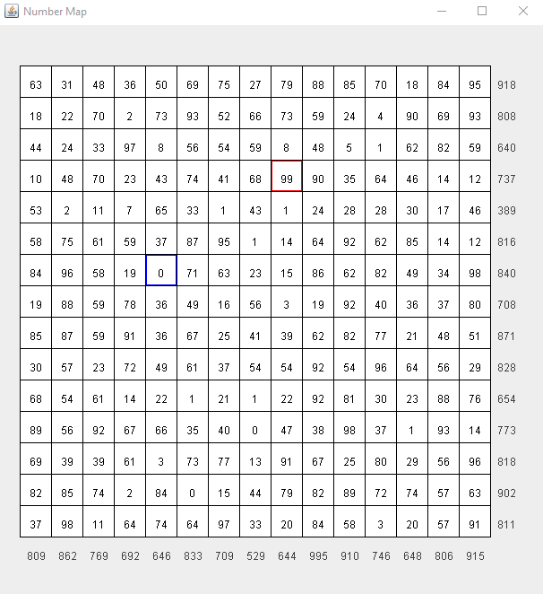

# NumberMap
This is an example program used in a Java programming course.  which can be used to highlight  the following topics:
* 2 dimensional arrays
* The JavaX Swing graphics library (without user interaction)
* JUnit testing

This program populates a 2 dimensional array with random numbers. The summation of each row and column is 
depicted as the last column and last row. The minimum and maximum numbers in the array are also highlighted.

All code presented here is for educational purposes only and does not knowingly contain any solutions
to labs, exams, or other assignments for any course. Feel free to use this code for your own
courses, self-instruction, or personal use but please retain the attribution to this source.

Ken Loomis